# IceToolbag
A blender addon for VSE.

Like its name, this toolbag should contain lots of things but not now.

This addon is made for personal use. I'm glad if it can help you. Contributions are welcomed.

 Current version: 0.0.6 alpha.

## Notice :bell:

1. **This addon is still in develop. Some features may not work properly.**

2. Only tested under blender 3.0 and windows 10.

3. **The addon will not compatible with older version before 1.0.0 stable version(if i still maintain this project in the future), so keep in mind don't use in a production environment.**

4. **To try this, go to `Download zip` or clone this repository. No packages released before stable version.** The tags in Github are in older version.

## Features :flags:

- Marker

  Marker mainly does the alignment task, such as `beat match`. Also the marker layer manager is provided.

| Feature         | Description                                                  | Demo                        |
| --------------- | ------------------------------------------------------------ | --------------------------- |
| Batch rename    | Rename all marker(`%d` represent the index of marker, similar to C language formatter). | 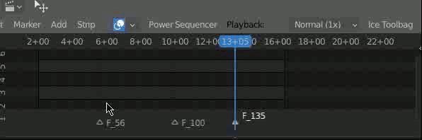         |
| Marker Layer    | Marker layer manager. You can switch to another layer or rename marker layers. | 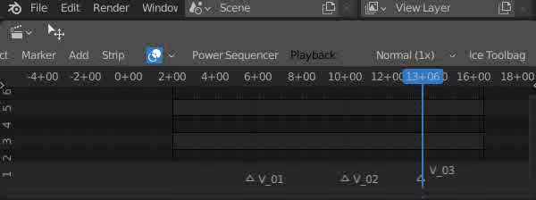         |
| Align to marker | Use marker to locate the position of strips and align together. | 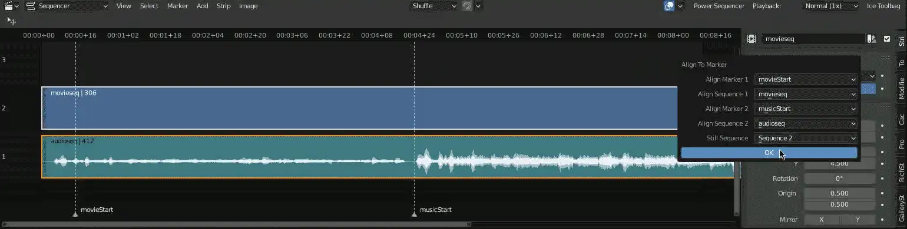 |
| Beat match      | With a movie strip and an audio strip with the corresponding markers, this operation will match them according to markers. |                             |

- Effects (:key: animation support, :hammer_and_wrench:developing )

  RichStrip is a template-base system which allows you to stack effects easily. This system is extensible. You can [write your own effects](CONTRIBUTING.md) in python if you are a developer.

| Features            | Description                                                  | Demo               |
| ------------------- | ------------------------------------------------------------ | ------------------ |
| Convert 2 RichStrip | Before adding following effects to a strip, you have to select a movie strip and an audio strip or just one movie strip and convert them into richstrip. | 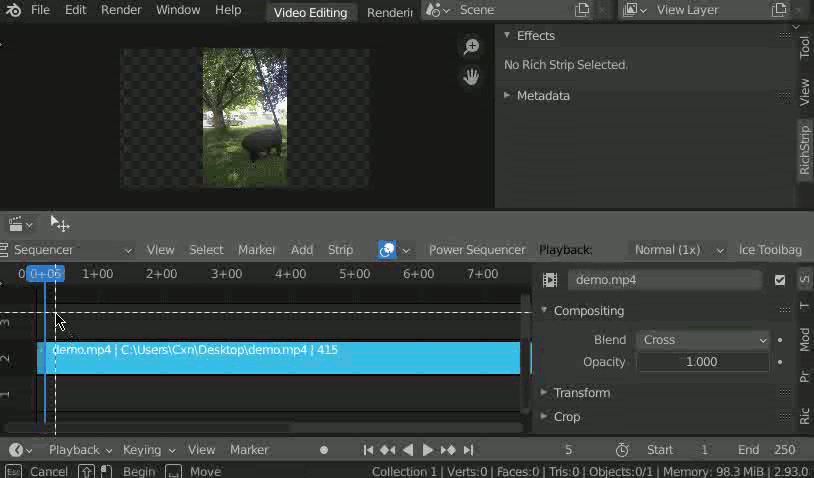  |
| Original Effect:key: | This effect allows you to make additional transformations to the original strip. This effect can't be created manually. It can't be deleted either. | 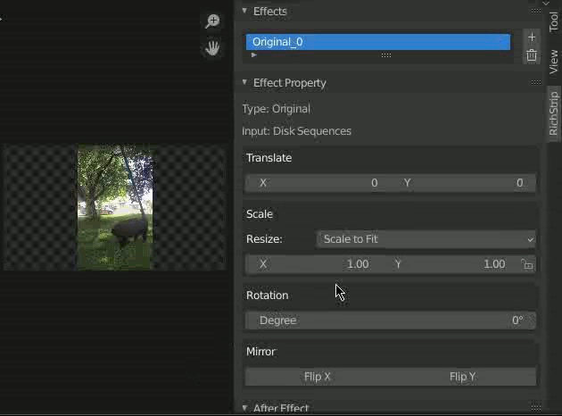   |
| FastBlur Effect​ :key: | Blender has Gaussian blur but pretty slow. This effect does a trick to blur the background. Be careful, the result can be influenced by proxy. | 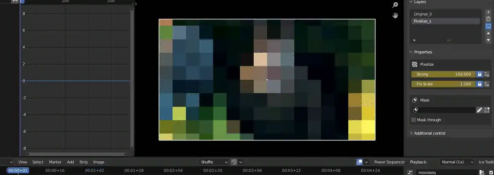 |
| Ramp Effect :hammer_and_wrench: | Like ramp node in nuke but less control. **Still has some bugs about the formulation.** | 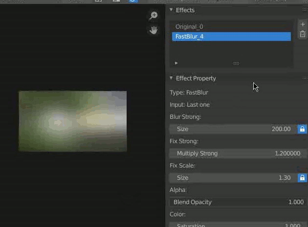  |
| Copy Effect | Copy `original strip` to top. | 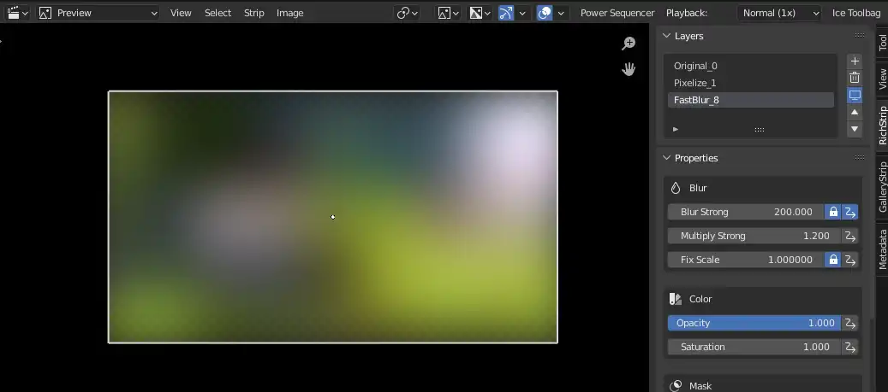 |
| Matte Effect :hammer_and_wrench: | Simple matte effect. **Still in progress. Doesn't work properly at the moment.** | 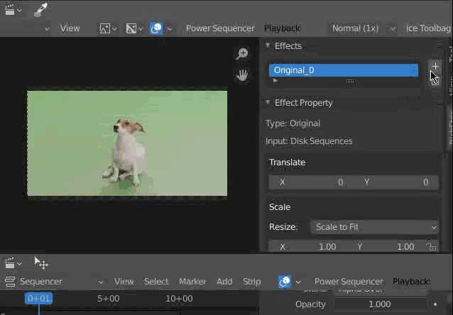 |
| Pixelize Effect :key: | Mosaic effect. Some edges might  miss so adjust `FixScale` to fix this. | 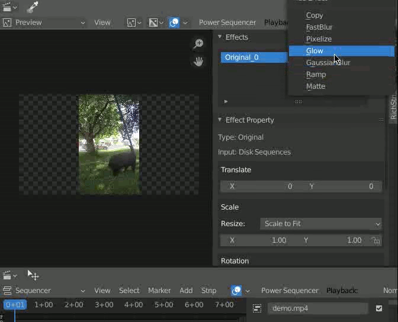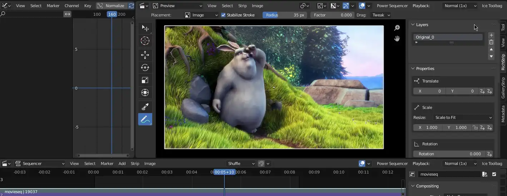 |
| Shadow Effect :key: | Add shadow. Shadow color can be animated. | 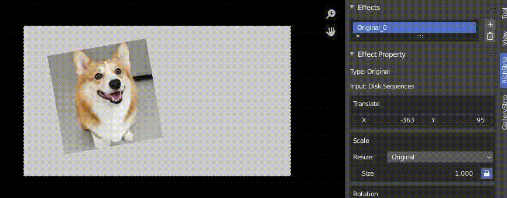 |
| Mirror Effect :key: :hammer_and_wrench: | Reflection effect. **Still in progress. Doesn't work properly at the moment.** | 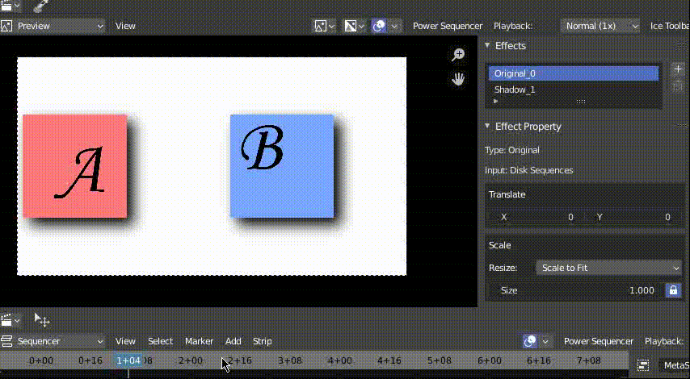 |
|GMIC :hammer_and_wrench: |**Set GMIC-Qt program filepath in preference window.** Use G'MIC effects in Blender. You can stack them together! **Still in progress. **|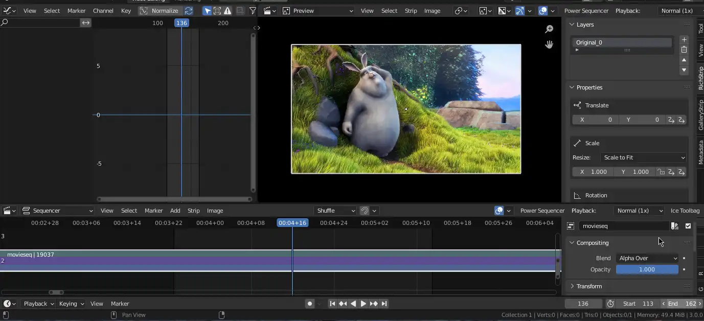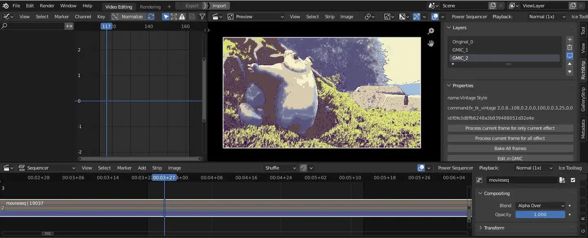  |
|Bright/Contrast Effect :key:|Adjust the bright and contrast.||
| Glow Effect :key: | Blender internal effect. |                    |
|Gaussian Blur Effect :key:|Blender internal effect.||

- Gallery

| Features                              | Description                                                  | Demo                 |
| ------------------------------------- | ------------------------------------------------------------ | -------------------- |
| Convert 2 Gallery Strip               | Select batch of images in one channel before converting them to gallery strip. | 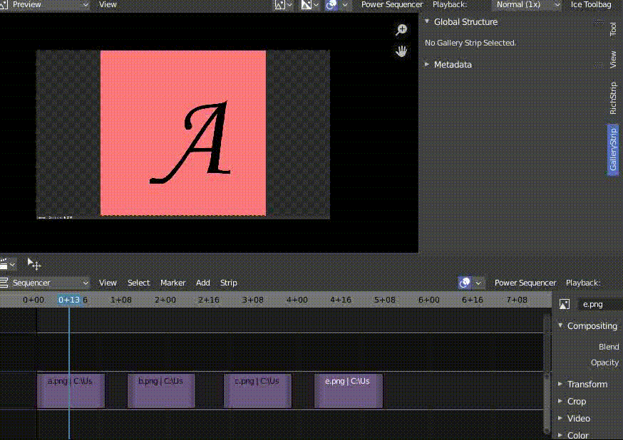 |
| Key Expression                        | (Not develop yet)                                            |                      |
| Mix with Gallery strip and Rich strip | As demo.                                                     | 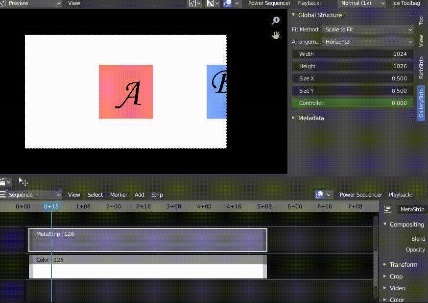 |

- Others

| Features     | Description                              | Demo                 |
| ------------ | ---------------------------------------- | -------------------- |
| Freeze Frame | Freeze/Hold current frame into an image. | 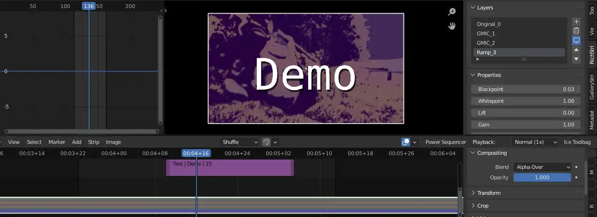 |

## TODO/Planning :chart_with_upwards_trend:

- Subtitle Strip to deal with subtitle and advanced font controller in blender**(Frameserver)**.
- Add common sticker, maybe a sticker library**(Delay)**.
- Gallery strip has expression to control all images at once.
- Gallery strip supports movies as input.
- Add animation support to g'mic effect.
- Improve performance.

## Known Issues :bug:

- While dragging the value, it seems blender costs lots of memory due to cache manager of blender.
- Seldom blender crash when dragging the value

## Last things...  :blush:

I apologize for my poor English in document. Feel free to open an issue if you have any questions.