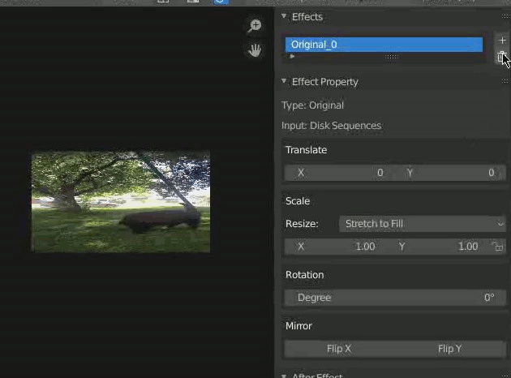
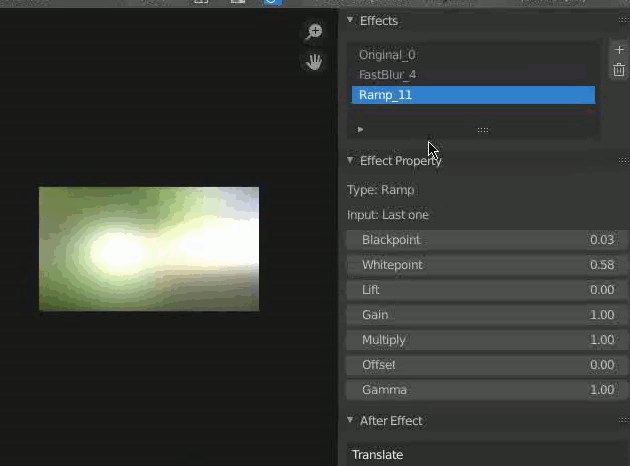

# IceToolbag
A blender addon for VSE.

Like its name, this toolbag should contain lots of things but not now.

This addon is made for personal use. I'm glad if it can help you. Contributions are welcomed.

## Notice :bell:

**Support for Blender 3.0 already, have fun.**

**This addon is still in develop. Some feature may not work properly. Current version: 0.0.5 alpha**

## Features :flags:

- Marker

  Marker mainly does the alignment task, such as `beat match`. Also the marker layer manager is provided.

| Feature         | Description                                                  | Demo                |
| --------------- | ------------------------------------------------------------ | ------------------- |
| Batch rename    | rename all marker(`%d` represent the index of marker).       |  |
| Marker Layer    | now marker has layer too. you can switch to another layer or rename this marker layer. |  |
| Align to marker | Align a strip to marker                                      |                     |
| Beat match      | input two marker layers with the corresponding markers of movie and audio, this operation will match them using `speed` strip. |                     |

- Effects (:key: animation support, :hammer_and_wrench:developing, :x: outdated )

  RichStrip is a template-base system which allows you to stack effects easily. All parameters are exposed so user can adjust them in one panel. This system is extensible. You can write your own effects.

| Features            | Description                                                  | Demo               |
| ------------------- | ------------------------------------------------------------ | ------------------ |
| Convert 2 RichStrip | Before adding effects to a strip, you need to select a movie and an audio strip or just one movie strip to convert. |   |
| Original Effect:key: | This effect represents the original strip which cannot be created manually but has lots of control like transformation and rotation. |    |
| FastBlur Effect​ :key: | Blender has Gaussian blur but pretty slow and not perfect when we want a blur background. This effect does a trick to blur the background. |  |
| Ramp Effect :hammer_and_wrench: | Like ramp node in nuke but less control. **Still has some bugs about the formulation.** |   |
| Copy Effect :x: | ~~Must select an effect you want to copy before adding this effect.~~(**OUTDATED**) |  |
| Matte Effect :hammer_and_wrench: | Simple matte effect. **Still in progress. Not work properly** |  |
| Pixelize Effect :key: | Mosaic effect.                                               |  |
| Shadow Effect :key: | Add shadow. |  |
| Mirror Effect :key: :hammer_and_wrench: | Reflection effect. **Still in progress. ** |  |
|Bright/Contrast Effect :key:|Adjust the bright and contrast.||
| Glow Effect :key: | Blender internal effect. |                    |
|Gaussian Blur Effect :key:|Blender internal effect.||
|GMIC :hammer_and_wrench: |Use GMIC effects in Blender. **Still in progress. **|  |

- Gallery

| Features                              | Description                                                  | Demo                 |
| ------------------------------------- | ------------------------------------------------------------ | -------------------- |
| Convert 2 Gallery Strip               | Select batch of images in one channel before converting them to gallery strip. |  |
| Key Expression                        | (Not develop yet)                                            |                      |
| Mix with Gallery strip and Rich strip | As demo.                                                     |  |

## TODO/Planning :chart_with_upwards_trend:

- ~~support move up and down the effect.~~(**Achieved**)
- ~~add more effects.~~(**Need idea**)
- ~~effects should has clip property and can interactive in viewport.~~(**No need, i think**)
- develop ~~Slider Strip~~(Gallery Strip, achieved), Subtitle Strip(With FFmpeg), etc.
- draw basic shape in viewport.
- add common sticker, maybe a sticker library.
- ~~effect has mask, user can draw it directly in viewport.~~(**Achieved**)
- gallery strip has expression to control all images at once.

## Known Issues :bug:

- when dragging the value, it seems blender costs lots of memory due to cache manager of blender.
- sometime blender crash when dragging the value

## Last things...  :blush:

I apologize for my poor English in document. Feel free to open an issue if you have any questions.